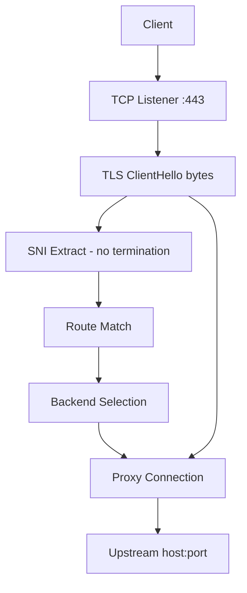

# SNI passthrough proxy

TLS reverse proxy that routes connections by **Server Name Indication (SNI)** without decrypting traffic — similar to [sniproxy](https://github.com/jameysharp/sniproxy-rs) and [mosajjal/sniplex-rs](https://github.com/mosajjal/sniplex-rs).

## How it differs from Hickory DNS

Hickory DNS terminates DNS protocols (UDP/TCP/DoT/DoH/DoQ) and routes **DNS queries** through a pipeline (blocklist, split by QNAME, etc.). It does **not** inspect TLS `ClientHello` on arbitrary TCP connections.

`hickory-sni-proxy` is a separate binary for **TLS passthrough** at layer 4/5.

## Flow



## Routing

| Pattern | Example | Matches |
|---------|---------|---------|
| Exact | `api.example.com` | `api.example.com` only |
| Wildcard | `*.bkash.com` | `pay.bkash.com`, `api.bkash.com`, `bkash.com` |
| Regex | `regex:^staging\\..+\\.example\\.com$` | Per regex rules |

Match order: **exact → longest wildcard → regex (config order) → `default_backend`**.

## Example requests

| SNI | Route | Backend |
|-----|-------|---------|
| `api.example.com` | exact `api.example.com` | `direct` → `8.8.8.8:443` |
| `login.example.com` | exact `login.example.com` | `direct` |
| `pay.bkash.com` | wildcard `*.bkash.com` | `bd-relay` → `10.10.0.1:443` |
| `www.google.com` | wildcard `*.google.com` | `direct` |

The proxy forwards the **original ClientHello and all subsequent TLS bytes** unchanged.

## Configuration

See `config/sni-proxy.toml`:

```toml
listen = "0.0.0.0:443"

[backends]
bd-relay = "10.10.0.1:443"
direct = "8.8.8.8:443"

[routes]
"*.bkash.com" = "bd-relay"
"*.nagad.com" = "bd-relay"
"*.google.com" = "direct"
"api.example.com" = "direct"
```

## Run

```bash
cargo run -p hickory-sni-proxy -- -c config/sni-proxy.toml
```

## Tests

```bash
cargo test -p hickory-sni-proxy
```
